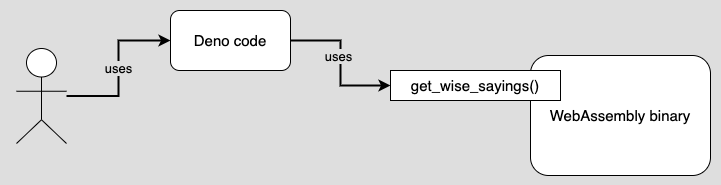

# wisesayingswasm
A project the demonstrates how to create a microservice as a WebAssembly binary created in Rust and have the WebAssembly binary hosted in a [Deno](https://deno.land/) webserver.



**The Deno web server uses the `get_wise_sayings()` function in the WebAssembly binary to get a random wise saying.**

## Prepping the Development Environment

**Step 1:** Make sure Rust is installed on your machine by typing:

`rustc --version`

You'll get output similar to the following:

`rustc 1.50.0 (cb75ad5db 2021-02-10)`


If the call to `rustc --version` fails, you don't have Rust instattled.

To install Rust, go here and install on **Linux/MAC:** ...

`curl --proto '=https' --tlsv1.2 -sSf https://sh.rustup.rs | sh`

... or here to install it on **Windows:**

Download and run [rustup-init.exe](https://static.rust-lang.org/rustup/dist/i686-pc-windows-gnu/rustup-init.exe).


**Step 2:** Linux users, add the additional required libraries

`sudo apt-get update -y`

`sudo apt-get install -y libssl-dev`

`sudo apt-get install -y pkg-config`

**Step 3:** Get the CLI tool for generating the ts/js adapter files

`cargo install wasm-bindgen-cli`

## Install Deno

**Linux/MAC**

`  curl -fsSL https://deno.land/x/install/install.sh | sh`

**Homebrew (MAC)**

`brew install deno`

**PowerShell (Windows)**

`iwr https://deno.land/x/install/install.ps1 -useb | iex`

**Chocolatey (Windows)**

`choco install deno`

**Scoop (Windows)**

`scoop install deno`

**Cargo (Windows)**

`cargo install deno`


## Creating the WebAssembly Binary

**Step 1:** Get the source code for the demonstration project, ***Wise Sayings*** from GitHub

`git clone https://github.com/reselbob/wisesayingswasm.git`

And go to the working directory

`cd wisesayingswasm.git`

**Step 2:** Build the WebAssembly binary

`cargo build --lib --target wasm32-unknown-unknown`

**WHERE**

* `cargo build` is the command to invoke the compiler
* `--lib` indicates that you're going ot build a library
* `--target` is the options that indicates target information 
* `wasm-unknown-unknown` is the name of the target name as well as the directory that will be created to for the target

**Step 3:** Generate the Javascript/TypeScript adapter files

`wasm-bindgen --target deno ./target/wasm32-unknown-unknown/debug/wisesayings.wasm --out-dir ./server`

**WHERE**

* `wasm-bindgen` is the command to to generate the adapter files
* `--target deno` indicates that the intended runtime target is Deno
* `./target/wasm32-unknown-unknown/debug/wisesayings.wasm` is the location of the WebAssembly binary
* `--out-dir ./server` is the option that declares the output directory for the adapter files, in this case `./server`. (If the directory does not exist, it will be created.)

The file output in `./server` will be as follows

```text
├── server
│   ├── main.ts
│   ├── package-lock.json
│   ├── wisesayings_bg.wasm
│   ├── wisesayings_bg.wasm.d.ts
│   ├── wisesayings.d.ts
│   └── wisesayings.js

```

## Get the Deno server up and running

**Step 1:** Start the Deno server that is hosting the WebAssembly binary

`deno run --allow-read --allow-net --allow-env ./main.ts`

You'll get output similar to the following:

```
HTTP webserver running at Sun Mar 07 2021 18:46:34 GMT+0000 (Coordinated Universal Time).  Access it at:  http://localhost:4040/
```

**Step 2:** In a separate terminal window, call the Deno server

`curl localhost:4040`

You'll get a random wise saying similar to the following:

`An apple a day keeps the doctor away.`


